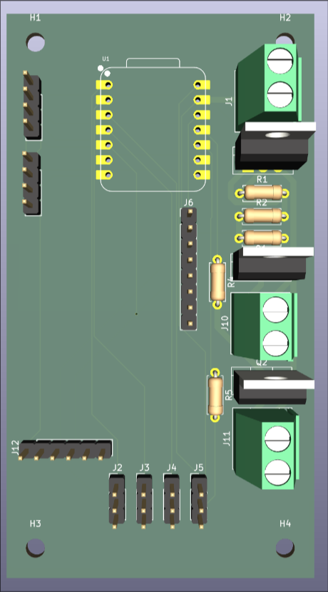
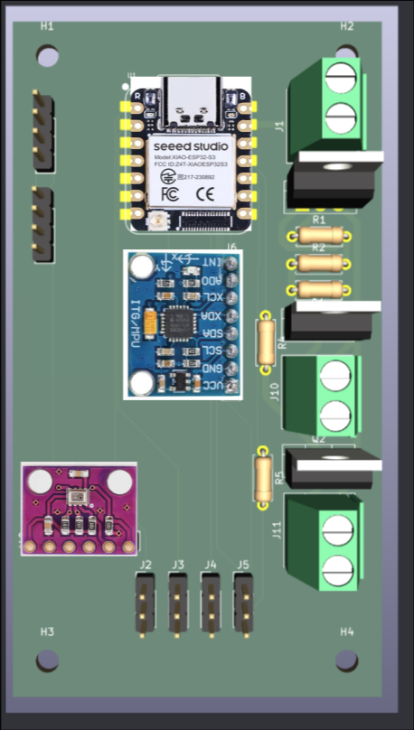

# CERAM

Cost Effective Rocket Aviation Module.

CERAM is a flight computer board for model rocketry, built around a simple idea: instead of hand soldering a big board full of tiny SMD parts, you plug in cheap breakout boards that cost a couple of dollars each. The board just wires them together.

## Why

Making a rocket flight computer usually means picking one of two paths. Either you buy a commercial unit and spend a lot of money, or you design your own PCB with a bare microcontroller, an IMU, a barometer and a pile of passives, then try to hand solder QFN packages with a normal iron. The second option likely results in failure.

## What is on it

CERAM is a carrier board. What goes on top of it defines its actual use.

- A Seeed Studio Xiao ESP32-S3 board serving as the MCU of the entire stack
- An MPU-6050 or other compatible IMU
- A BMP280 or other compatible barometer
- 4 PWM outputs
- A UART Header
- An I2C Header
- A LM317 for voltage regulation
- Two IRLZ44N MOSFETs for parachute deployment/reaction wheel driving/motor igniting/pyrotechnic uses

## BOM

| Part | Link | Cost |
|---|---|---|
| Screw Terminals 5.08mm | <https://www.aliexpress.us/item/2251832621219818.html> | $1.96 |
| Resistor Kit (not requesting) (1x 220ohm 2x 330ohm 3x 10k ohm) | <https://www.aliexpress.us/item/3256808562766775.html> | $3.17 |
| IRLZ44N (not requesting)| <https://www.aliexpress.us/item/3256807934257560.html> | $2.30 |
| LM317 | <https://www.aliexpress.us/item/3256803468041967.html> | $1.91 |
| Header Pins | <https://www.aliexpress.us/item/3256807247428541.html> | $1.84 |
| Seeed Studio Xiao ESP32-S3 (equal to or less than aliexpress pricing when including shipping charges) | <https://www.amazon.com/ESP32S3-2-4GHz-Dual-core-Supported-Efficiency-Interface/dp/B0BYSB66S5> | $16.99 |
| BMP280 (aliexpress only has fake clones trust me) | <https://www.amazon.com/Atmospheric-Pressure-Modules-Barometric-Compatible/dp/B0FDWN2LVS/> | $6.62 |
| MPU6050 | <https://www.aliexpress.us/item/3256809482368154.html> | $2.82 |
| JLC PCB | (see CERAM-V2.zip in pcb/production) | $5.30 |
| Total | . | $42.91 |

## Software
Included is a board test program (`firmware/BoardTest`) that initializes the IMU, barometer, and servos and streams all sensor readings over serial.
Please use the build.sh command to build and flash (you may need to change ports).

## PCB
Completed gerbers can be found in `pcb/production/CERAM-V2.zip`.

## License

MIT. See LICENSE.
